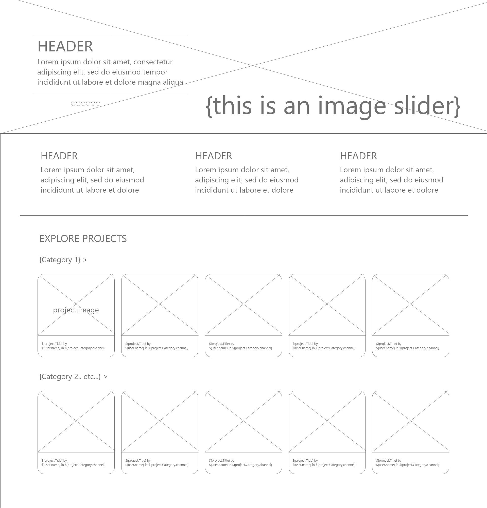
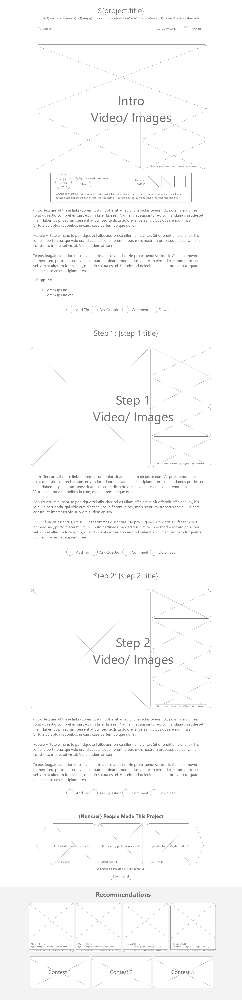

# README - Feature 00: Home Page

## Models Needed

Projects

## Endpoints Needed
 '/'
 '/projects/:sort'

### main home page: '/'

### projects homepage: '/projects/:sort'

* STRETCH GOAL - default projects sort is by featured (:sort not specified)
  * for now our default sort will be creation date (most recent)
* other sort values - Ed says ALL sort options should be STRETCH GOALS
  * sort by recent (_:sort = recent/_)
  * sort by popularity (_:sort = popular/_)
  * sort by views (_:sort = views/_)
  * sort by contest winners (_:sort = winners/_)

## Templates Needed

* index.pug
* layout.pug (nav-bar, header, footer, background image, a content div)

## Wire Frames or Sketches

* rough wireframe of homepage 
* Home page 
* Header and footer layout 

## brainstorm

we would see:

* navbar
  * homepage link
  * login link
  * sign up link
  * keywords search bar
* existing projects (optional sort)

non-users (not signed in) are redirected to registration page ('/account/register/') upon attempting to:

* create a project
* favorite a project
* create a comment
