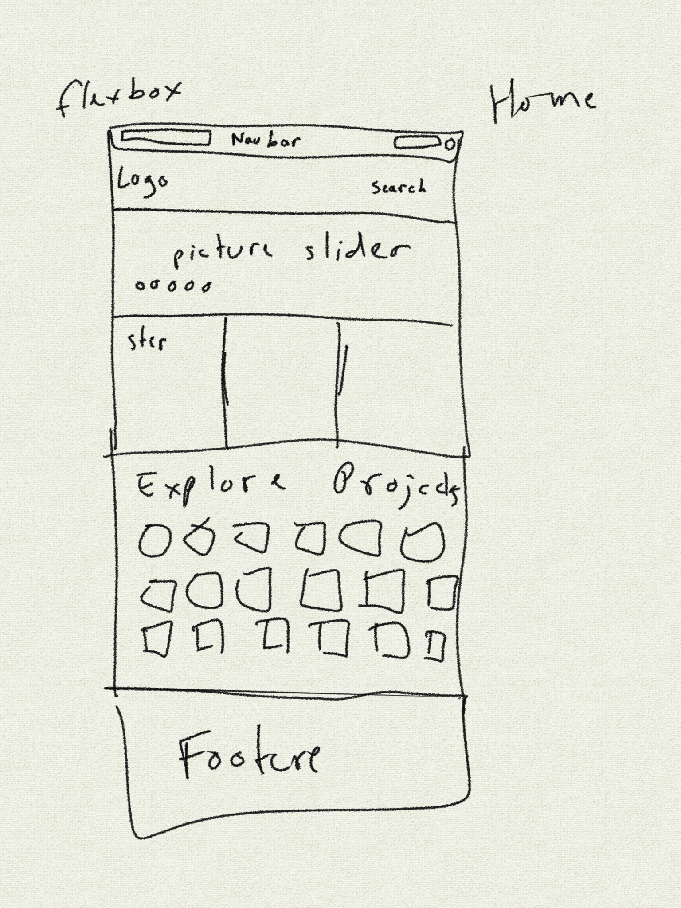

# README - Feature 00: Home Page

## Models Needed

Projects

## Endpoints Needed
 '/'
 '/projects/:sort'

### main home page: '/'

### projects homepage: '/projects/:sort'

* default projects sort is by featured (:sort not specified)
* other sort values:
  * sort by recent (_:sort = recent/_)
  * sort by popularity (_:sort = popular/_)
  * sort by views (_:sort = views/_)
  * sort by contest winners (_:sort = winners/_)

## Templates Needed

## Wire Frames or Sketches

* rough wireframe of homepage 

## brainstorm

we would see:

* navbar
  * homepage link
  * login link
  * sign up link
  * keywords search bar
* existing projects (optional sort)
