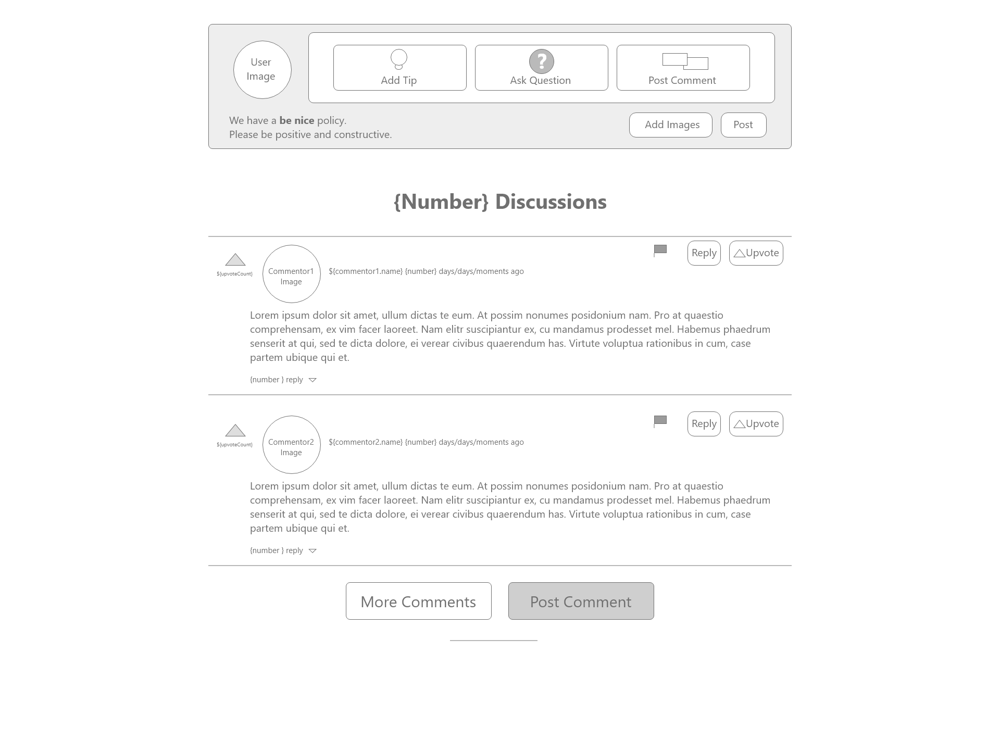

# README - Feature 2: Commenting on Projects

## Models Needed

* comment
  * content (the actual content)
  * projectId (fk - comments are tied to a project)
  * userId (fk - comments are tied to a user)
  * id (added automatically)
  * createdAt (added automatically to migration by sequelize)
  * modifiedAt (added automatically to migration by sequelize - used for sorting comments by most recent)
* user (tied to fk)
* project (tied to fk)

## Endpoints Needed

### create comment on a project

* No real endpoint - use AJAX to post to database without page reload (no change in URL)

### read comment on a project

* anyone should be able to read comments on project - comments should load on project page load

### update comment on a project

* similar to create - should be implemented with AJAX so no page reload. Clicking on "edit comment" button should bring up comment form with previous comment content. Submission of updated comment should update the content and modifiedAt and changes should be reflected on page without reload.

### delete comment on a project

* again, same as create/update. Use AJAX so no page reload. Should remove comment from database.

## Templates Needed

* comments.pug which is going to be a part of the read_project.pug template

## Wire Frames or Sketches

* Comment on project page 
