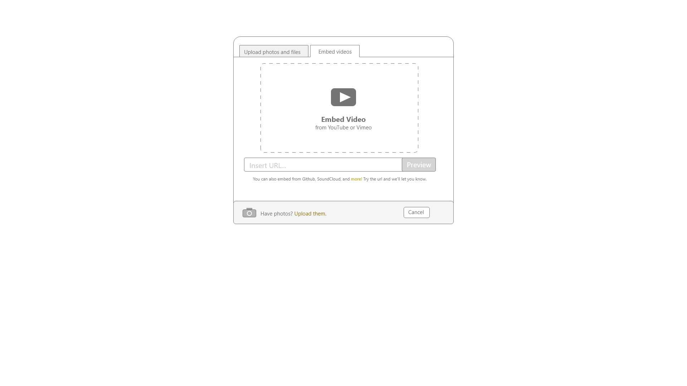
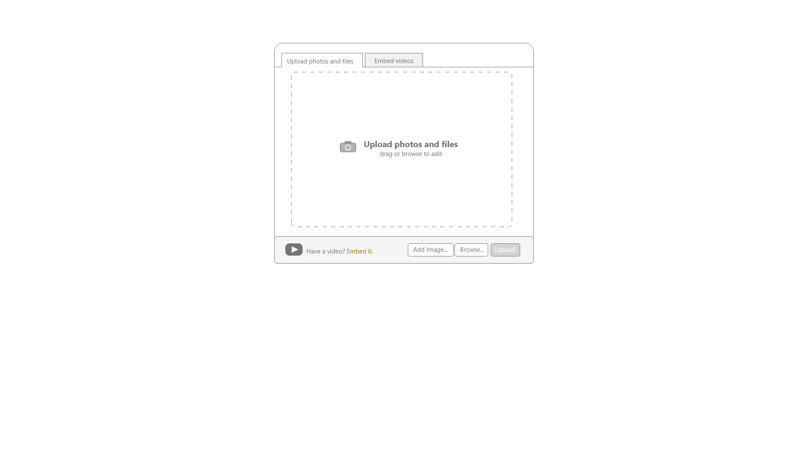

# README - Feature 3: Adding Photos and Videos to Projects

## Models Needed

## Endpoints Needed

### while editing your project (/editInstructable/edit/:projectId) or editing project steps (/editInstructable/edit/:projectId/step/:stepId) we need buttons on page to do the following (using AJAX?)

* upload photos and files
  * STRETCH GOAL - upload media from your own instructable library
  * STRETCH GOAL - upload media to your own instructable library
  * **upload media to project from local machine (browse)** (this is our primary focus)
  * STRETCH GOAL - upload media with drag and drop
* STRETCH GOAL - embed videos
  * embed with with URL
  * embed with drag and drop

## Templates Needed

* part of the edit_project template

## Wire Frames or Sketches

* STRETCH GOAL - Embed video page 
* Upload file/photo 
