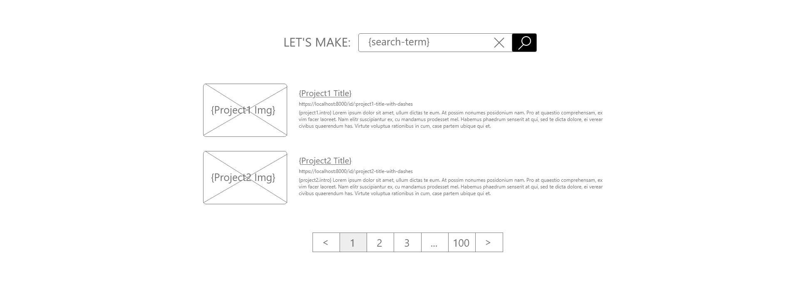

# README - Feature 4: Searching Projects by Keyword

## Models Needed

* Project
* User

## Endpoints Needed

### search all categories by keyword: '/search/results/:keyword/'

* searching Project and Users

### search specific categories by keyword: '/:category/howto/:keyword/'

* this is related to the categories bonus feature (see [Categories ReadMe](./6-categories-readme.md))

## Templates Needed

* part of the layout template

## Wire Frames or Sketches

* Search project page 
